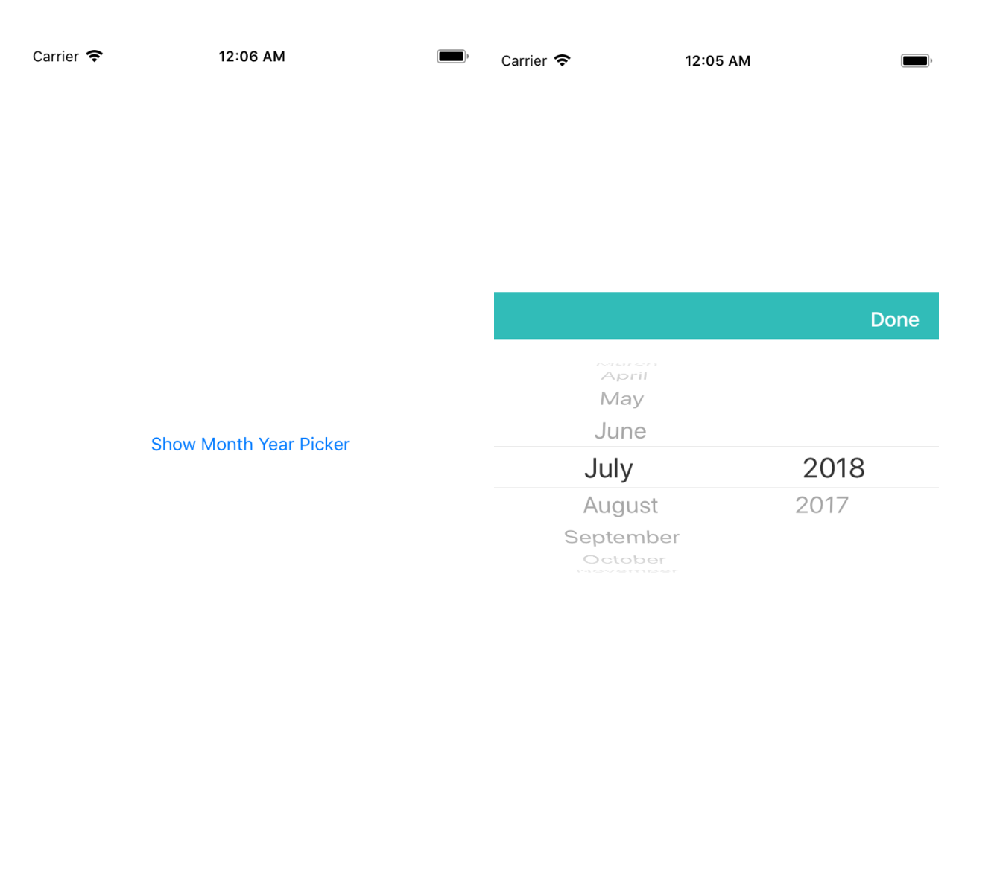

<p align="center" >
  
</p>

# AKMonthYearPickerView

AKMonthYearPickerView is a lightweight, clean and easy-to-use Month/ year picker control in iOS written purely in Swift language.

## Getting Started

This month year picker view will callback when the user change month or year or user clic on done button. 

### Installing

You can install it using pods or manually importing file in project.

#### Installing using Pods

Add pod 'AKMonthYearPickerView' to your Podfile

```
pod 'AKMonthYearPickerView' 
```


#### Installing Manually

Add pod 'AKMonthYearPickerView.swift' file into your project and just start using this library.


### Usage

You can use this library in your project using pods or manually importing the library file.

```
import AKMonthYearPickerView

AKMonthYearPickerView.sharedInstance.show(vc: vc, doneHandler: doneHandler, completetionalHandler: completetionalHandler)

```

#### Customizing the color

You can also customize the toolbar color.

```
AKMonthYearPickerView.sharedInstance.barTintColor =   UIColor.blue

AKMonthYearPickerView.sharedInstance.previousYear = 4

```

## Authors

* **Ali Khan** - [ali-cs](https://github.com/ali-cs)


## License

This project is licensed under the MIT License - see the [LICENSE.MIT](LICENSE.MIT) file for details

## Acknowledgments

* Pull requests are warmly welcome as well.
* This project is inspired by the other library [MonthYearPickerView-Swift]
 (https://github.com/bendodson/MonthYearPickerView-Swift)

